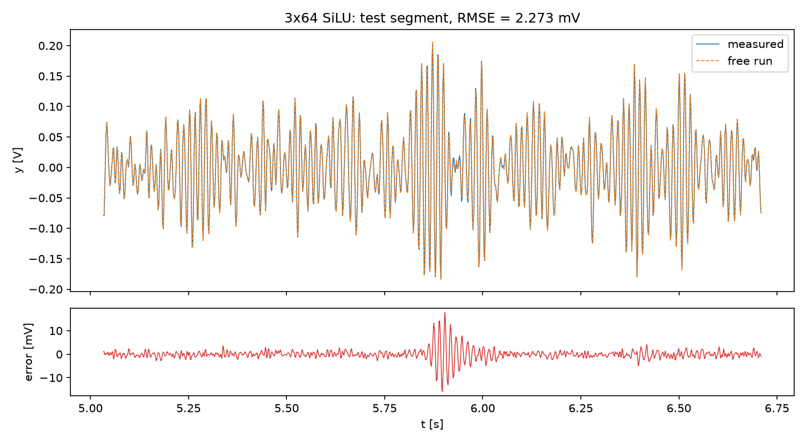
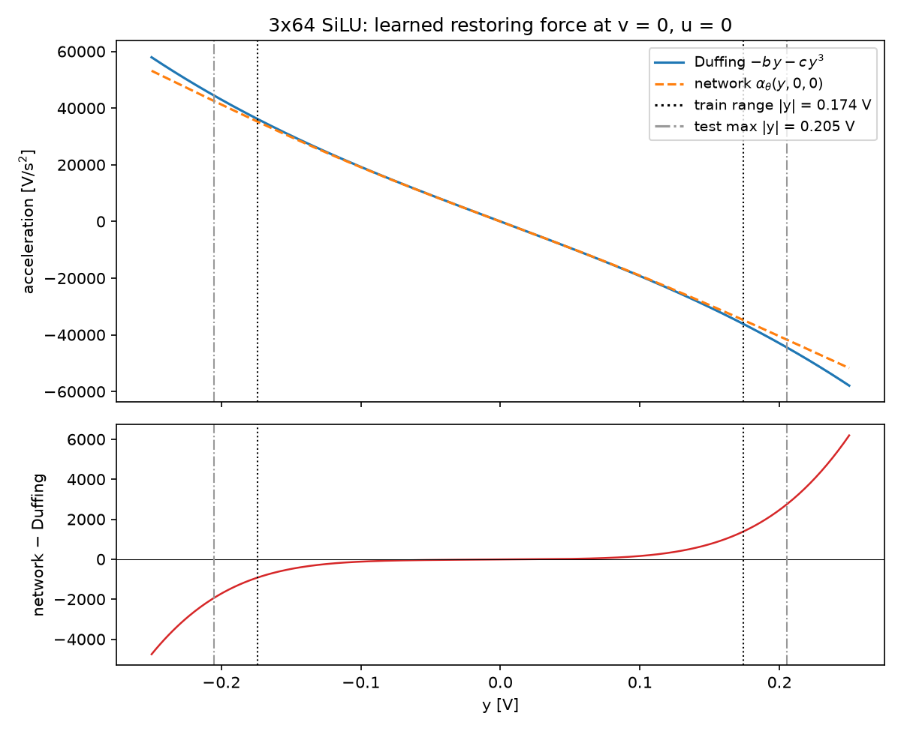

# Task 5. PINN for the Silverbox oscillator

**Code:** <https://github.com/HenrikGharagyozyan/silverbox-pinn>

## 1. Data

Silverbox benchmark (Wigren and Schoukens, ECC 2013), file `SNLS80mV.mat`: channel V1 is the input voltage u(t), channel V2 is the output voltage y(t), sampled at fs = 610.35 Hz (Δt = 1/fs = 1.638 ms).

- Excerpt: samples [42650 : 46746], 4096 samples (6.71 s), 2000 samples after the start of the multisine.
- The means of u and y over the excerpt are subtracted (u: 6.66 mV, y: 1.32 mV). All numbers below refer to the centered signals.
- Train record: first 3072 samples (5.03 s). Test record: last 1024 samples (1.68 s).
- RMS of the test output, i.e. the RMSE of predicting zero: **60.49 mV**.
- The output spectrum peaks at 68.5 Hz.
- Largest output amplitude: |y| = 0.174 V on the train record and 0.205 V on the test record. This matters in Section 7.

## 2. State equation and integrator

The acceleration is produced by a network αθ. With velocity v = ẏ the state is (y, v):

> ẏ = v,  v̇ = αθ(y, v, u)

The state is integrated with classical fourth-order Runge–Kutta at step Δt, driven by the measured input. The input is only known at the samples, so the value at the midpoint of a step is taken as u(tn + Δt/2) = (u[n] + u[n+1]) / 2. All computations are in float64 and batched over windows (`src/integrator.py`). A unit test on a forced, damped linear oscillator with a known analytic solution gives an observed convergence order of 4.00 (`tests/test_integrator.py`).

**Free-run metric** (`src/metrics.py`). The weights are fixed, then one rollout of all 4096 samples is made:

- It starts at the first sample with the measured y[0] and the second-order one-sided finite-difference velocity v0 = (−3y[0] + 4y[1] − y[2]) / (2Δt).
- It reads only u and carries the state across the train/test boundary.
- The RMSE is computed separately on the 3072 train samples and on the 1024 test samples.

## 3. Kept architecture

αθ is a plain fully connected network (`src/model.py`):

| item | value |
|---|---|
| inputs | (y / σy, v / σv, u / σu) |
| hidden layers | 3 × 64, SiLU |
| output | 1 linear unit, multiplied by σa |
| weights | 8641 |
| precision | float64 |

The scales are fixed constants computed on the train record only:

- σy = 0.0530 V
- σv = 20.65 V/s, from central differences of y
- σu = 0.0220 V
- σa = 9886 V/s², the standard deviation of the second difference of y

The coefficients a, b, c, g of equation (1) are not parameters of this model. The network has to represent the whole force −a v − b y − c y³ + g u.

## 4. Training

Everything uses the training record only, with seed 0 (`src/train.py`). Training has two stages; a third stage exists but was not used for the kept version.

**Stage 1. Pretraining by regression.** αθ(y[n], v[n], u[n]) is fitted to the second difference (y[n+1] − 2y[n] + y[n−1]) / Δt². The velocity v[n] is the central difference.

- 3000 full-batch Adam steps, lr 3·10⁻³ with cosine decay.
- This is only a rough start. At about 9 samples per period the second difference underestimates the acceleration by about 4%, so the free run after this stage is still poor: 22.3 mV on train and 30.0 mV on test.

**Stage 2. Rollout training.** Each step draws 256 random windows from the train record. Every window is integrated with RK4, starting from the measured y and the central-difference velocity, and the loss is the MSE of y divided by σy².

- Window length schedule: K = 32 for 800 steps, then K = 128 for 600 steps.
- Adam with learning rate 10⁻³, cosine-decayed to 10⁻⁴ over the stage.
- Gradient norm clipping at 1.0.
- Time: 1006 s on one CPU thread. Four runs ran in parallel on a 4-core machine.

**Stage 3 (optional, off for the kept version).** Adam, optionally followed by L-BFGS, on the full free run of the train record. In the first experiment (2×32 tanh) it changed the test RMSE from 5.645 to 5.600 mV at a cost of about 3 minutes, so it was disabled in the sweep.

As a physical reference, equation (1) with four trainable coefficients was fitted the same way (`scripts/baseline_duffing.py`): least squares on finite differences, then rollouts. The result is a = 41.0 s⁻¹, b = 1.850·10⁵ s⁻², c = 7.47·10⁵ V⁻²s⁻², g = 1.948·10⁵ s⁻². Here √b corresponds to 68.5 Hz, and at |y| = 0.2 V the cubic force is about 16% of the linear one.

## 5. Results of the kept version

| model | free-run RMSE train | free-run RMSE test |
|---|---|---|
| zero prediction | 53.0 mV | 60.5 mV |
| **3×64 SiLU network (kept)** | **1.029 mV** | **2.273 mV** |
| Duffing equation (1), 4 coefficients | 0.954 mV | 0.996 mV |

The network reduces the test error 27-fold compared with predicting zero, about 3.7% of the test RMS. It is still 2.3 times worse on test than the four-coefficient Duffing model, although both fit the train record equally well.

*Figure 1. Measured and predicted output on the test segment (the prediction is the free run started at the first sample of the excerpt). Bottom: prediction error.*

## 6. Architectures and hyperparameters tried

The sweep (`scripts/sweep.py`, all rows in `results/sweep.csv`) had two phases:

- **Phase 1:** eight architectures (1×32, 2×32, 2×64, 3×64; tanh and SiLU) with the default training: lr 3·10⁻³, K schedule 32 → 128 → 512 with 400 / 300 / 150 steps, pretraining on.
- **Phase 2:** the two best architectures from phase 1 (3×64 SiLU, 2×64 SiLU) with a grid over:
    - learning rate {10⁻³, 3·10⁻³};
    - number of steps {×1, ×2};
    - final window length K {128, 512};
    - pretraining {on, off}.

**The sweep was stopped after 16 of the planned 38 runs** because of the available compute: one run takes 6–23 minutes on this CPU. The phase-2 grid for 2×64 SiLU was not run at all. Six phase-2 runs for 3×64 SiLU were also not run: learning rate 3·10⁻³ with ×2 steps, and learning rate 10⁻³ with ×2 steps and K = 512.

All 16 completed runs, sorted by test RMSE. Time is wall time with four runs in parallel.

| # | network | lr | steps | final K | pretrain | weights | time, s | train, mV | test, mV |
|---|---|---|---|---|---|---|---|---|---|
| 1 | 3×64 SiLU | 1e-3 | ×2 | 128 | yes | 8641 | 1068 | 1.028 | **2.273** |
| 2 | 3×64 SiLU | 3e-3 | ×1 | 512 | yes | 8641 | 1029 | 0.997 | 2.740 |
| 3 | 3×64 SiLU | 3e-3 | ×1 | 128 | yes | 8641 | 573 | 1.057 | 2.821 |
| 4 | 3×64 SiLU | 1e-3 | ×1 | 512 | yes | 8641 | 1376 | 1.010 | 2.848 |
| 5 | 3×64 SiLU | 1e-3 | ×1 | 128 | yes | 8641 | 593 | 1.069 | 3.013 |
| 6 | 2×64 SiLU | 3e-3 | ×1 | 512 | yes | 4481 | 893 | 1.048 | 3.405 |
| 7 | 3×64 SiLU | 1e-3 | ×2 | 128 | no | 8641 | 1001 | 1.124 | 3.425 |
| 8 | 2×32 SiLU | 3e-3 | ×1 | 512 | yes | 1217 | 605 | 1.066 | 3.474 |
| 9 | 3×64 SiLU | 1e-3 | ×1 | 512 | no | 8641 | 1286 | 1.142 | 3.794 |
| 10 | 3×64 SiLU | 1e-3 | ×1 | 128 | no | 8641 | 498 | 1.226 | 3.800 |
| 11 | 1×32 SiLU | 3e-3 | ×1 | 512 | yes | 161 | 394 | 1.163 | 3.945 |
| 12 | 3×64 SiLU | 3e-3 | ×1 | 128 | no | 8641 | 504 | 1.173 | 4.041 |
| 13 | 2×64 tanh | 3e-3 | ×1 | 512 | yes | 4481 | 833 | 0.993 | 4.952 |
| 14 | 2×32 tanh | 3e-3 | ×1 | 512 | yes | 1217 | 561 | 1.002 | 5.645 |
| 15 | 3×64 tanh | 3e-3 | ×1 | 512 | yes | 8641 | 980 | 0.976 | 7.608 |
| 16 | 1×32 tanh | 3e-3 | ×1 | 512 | yes | 161 | 368 | 1.592 | 8.600 |

"Steps ×1" is 400 steps at K = 32, 300 at K = 128 and 150 at K = 512, truncated at the final K. "×2" doubles every count.

Observations:

- **Activation matters most.** All networks reach about 1 mV on the train record, but SiLU is better on test for every architecture: 2.7–3.9 mV against 5.0–8.6 mV with tanh.
- **Depth helps with SiLU.** With the default training, test RMSE goes from 3.95 mV (1×32) through 3.47 mV (2×32) and 3.41 mV (2×64) to 2.74 mV (3×64).
- **Pretraining always helps.** In each of the four on/off pairs, pretraining improves the test RMSE by 0.8–1.2 mV.
- **More short-window steps beat long windows.** For 3×64 SiLU with lr 10⁻³, doubling the steps with K up to 128 gave 2.27 mV. Extending the windows to K = 512 instead gave 2.85 mV, at a higher cost.

## 7. The train/test gap

On the train record the kept network (1.03 mV) is almost as good as the Duffing model (0.95 mV). On the test record it is not (2.27 against 1.00 mV), and the reason is the amplitude range:

- The largest output on the train record is |y| = 0.174 V, while the test record reaches 0.205 V around t = 5.9 s.
- The network has never seen the restoring force at these amplitudes and has to extrapolate it.
- The Duffing model extrapolates correctly because the form −b y − c y³ is built into it.

Figure 2 compares the learned force αθ(y, 0, 0) with the Duffing force −b y − c y³:

- **Inside the dense part of the train range they agree:** the network is 0.8% weaker at y = 0.1 V.
- **Near the edge of the train range they start to diverge:** 3.8% at 0.174 V, where the train record has only a few samples.
- **Beyond it the gap keeps growing:** 6.2% at the test peak of 0.205 V. The network grows almost linearly where the true spring stiffens cubically, so the predicted oscillation at large amplitude is too soft and slips in phase.

The error confirms this:

- In the burst t ∈ [5.8, 6.1) s the test RMSE is 4.84 mV; on the rest of the test record it is 1.09 mV, the same level as on train.
- The same split for the first 2×32 tanh network gives 12.8 mV in the burst and 1–2 mV elsewhere. A tanh network saturates beyond the data, which is why tanh is the worst activation in the table.

*Figure 2. Top: learned acceleration αθ(y, 0, 0) and the Duffing restoring force −b y − c y³ of the fitted baseline. Bottom: their difference. Dotted lines: largest |y| on the train record (0.174 V). Dash-dotted lines: largest |y| on the test record (0.205 V).*

## 8. Reproduction

The commands are listed in the README of the repository:

- `scripts/final.py` reproduces both numbers and both figures of the kept version from `results/best.pt` with a single free run.
- `python -m src.train --config <json>` retrains a configuration.
- `scripts/sweep.py` reruns the sweep and resumes from `results/sweep.csv`.
